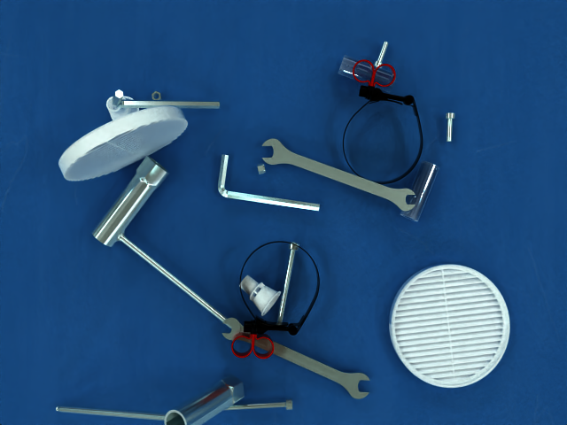
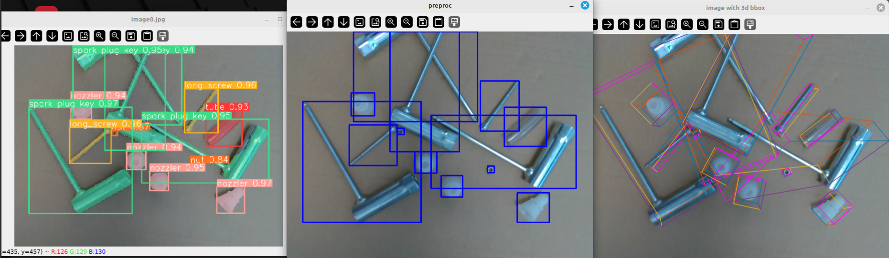

# Advancing Industrial Vision Research with SyGRID: Synthetically Generated Realistic Industrial Dataset
Welcome to the new *SyGRID dataset repository, designed for industrial applications in computer vision and robotics. [Intro Video](videos/video_sygrid_intro.mp4)

## Table of Contents

- [Abstract](#Abstract)
- [Dataset Description](#dataset-description)
- [Download](#download)
- [Data Format](#data-format)
- [Benchmarks](#benchmarks)
- [License](#license)
- [Citation](#citation)
- [Contact](#contact)

## Example



## Real World Demo
Click here for the [Demo Video](videos/video_sygrid_robotic.mp4)


## Abstract

 Industrial automation depends on accurate object recognition and localization tasks, such as depth estimation, instance segmentation, object detection, and 6D pose estimation. Despite significant advancements, numerous challenges persist, especially within industrial settings. To address these challenges, we propose SyGRID, (Synthetically Generated Realistic Indus-
trial Dataset), a new simulated, realistic dataset specifically designed for industrial use cases. Its novelty lies in several aspects: the generated frames are photo-realistic images of
objects commonly used in industrial settings, capturing their unique material properties; this includes reflection and refraction under varying environmental light conditions. Moreover,
SyGRID includes multi-object and multi-instance cluttered scenes accurately accounting for rigid-body physics. Aiming to narrow the currently existing gap between research and
industrial applications, we also provide an exhaustive study on different tasks: namely 2D detection, segmentation, depth estimation and 6D pose estimation. These tasks of computer
vision are essential for the integration of robotic applications such as grasping. SyGRID can significantly contribute to industrial tasks, leading to more reliable robotic operations. By providing this dataset, we aim to accelerate advancements in robotic automation, facilitating the alignment of current progress in computer vision with the practical demands of industrial robotic applications.


## Dataset Description
The dataset contains the following:

- **Images**: 10,048 simulated photo-realistic images with resolution 640x480, for a total of 155,842 instances.
- **Annotations**: 
  - **2D Object Detection**: Bounding boxes for 20 different object categories.
  - **2D Object Detection**: Bounding boxes for 20 different object categories.
  - **Segmentation**: Pixel-wise annotations for semantic and instance segmentation.
  - **Depth Estimation**: Depth maps.
  - **Pose Estimation**: Rotation and Translation matrix for each object instance.


## Download

git clone 'this repository'

## Data Format

sygrid-dataset/#
├── depth/#
├── rgb/#
├── gt.pickle#
├── README.md#
└── LICENSE#

- **Images** are in the rgb/ folder in .png format.
- **Labels** are in the gt.pickle file expressed as a dictionary:
   ```python
    labels = {
        ["000001":[
            "cam_K": list,
            "objects": [{
                'obj_id': int,
                'inst_id': int,
                'R': list,
                't': list,
                'bbox': list,
                '3d-bbox': list,
                'segmentation': list
                },
                ...,
                {
                'obj_id': int,
                'inst_id': int,
                'R': list,
                't': list,
                'bbox': list,
                '3d-bbox': list,
                'segmentation': list
                }]
        ],
        "000002":[
            "cam_K": list,
            "objects": [...
        ],
        ...
        ]
    }

## Benchmarks

- 2D Detection and Instance Segmentation with YOLOv8
- Depth Estimation with Depth Anything
- 6D Pose Estimation with GDR-net

## License

SyGRID © 2024 by Nicola Capodieci, Davide Sapienza, Elena Govi, Luca De Dominicis, Marko Bertogna is licensed under Creative Commons Attribution-NonCommercial-ShareAlike 4.0 International 

For commercial use: write to one of the contacts.

## Citation

## Contact 

elena.govi@unimore.it

nicola.capodieci@unimore.it

davide.sapienza@unimore.it
